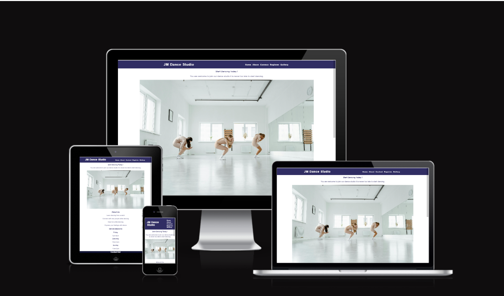
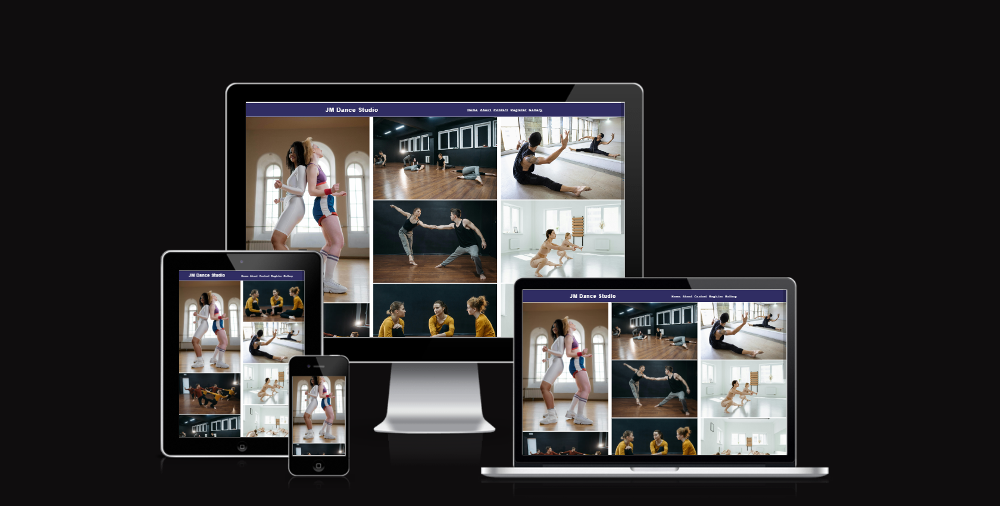

# JM DANCE STUDIO

## WHAT THE WEBSITE IS ABOUT

JM Dance studio is a website design for people who wants to improve their dance move and also connect with new people and make new friends.
all the informations on how to register and the time for dance class can be found in this website and the contact information.

[Website link](https://jojoakh.github.io/JM-Studio/)

## Features

There are several features on the website to help intended users navigate through the pages to enable them understand what the website is for.

### Existing Features

- **Navigation Bar**

    - The navigation bar featured at the top of the page. it shows the name of the studio and the navigation links to the pages- Home, About, contact, Register, gallery.
    
    - The navigation bar has a  background-color: rgb(48, 45, 99); and color: whitesmoke.
    - 

 

