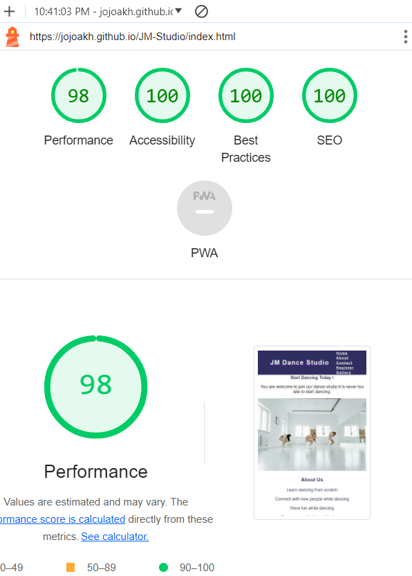

# JM DANCE STUDIO

## WHAT THE WEBSITE IS ABOUT

JM Dance studio is a website design for people who wants to improve their dance move and also connect with new people and make new friends.
all the informations on how to register and the time for dance class can be found in this website and the contact information.

### Color Scheme

- `#302d63` used primarily for the background colour for features such as navbar, color for text in the about section, background color for submit button.
- `#111434` used for footer.
- `#f5f5f5` used for some text through out the page.

I used [coolers](https://coolors.co/302d63-111434-f5f5f5) generate my color palette.

### Typography

- [Roboto](https://fonts.google.com/share?selection.family=Roboto+Serif:ital,opsz,wdth,wght,GRAD@0,8..144,50..150,100..900,-50..100;1,8..144,50..150,100..900,-50..100) used for the body.

- [Font Awesome](https://fontawesome.com) icons were used the social media links in the the footer.

## Features

There are several features on the website to help intended users navigate through the pages to enable them understand what the website is for.

### Existing Features

- **Navigation Bar**

    - The navigation bar featured at the top of the page. it shows the name of the studio and the navigation links to the pages- Home, About, contact, Register, gallery.
    
    - The navigation bar has a  background-color: rgb(48, 45, 99); and color: whitesmoke.
    
    

    

 - **The image section**

    - This section shows the image used for in the first page.
    - the image clearly shows what this website is about to potential users.

    

- **About Us section**
    - This section shows the potential users what JM dance studio has to offer.
    - this section also includes the days and time for dance lessons.

    

- **Footer**
    - The Footer is featured in all the pages.
    - the footer contains contact information incase the users needs to get in touch.
    - the contact information includes: Phone number, Email, and Address.
    - the footer also includes social media icons which the users can just click on to find JM dance studio on facebook, twitter, youtube, and instagram.

- **Register section**

    - In this section, a person can register for the dance lessons.
    - The form collects the name, email and gender of the person who wants to register.
    - The register section opens in a different page.
    - The Register form has a validator that encourages users to use a valid email when signing up.
    - The Register page redirects you to a thank you page after submitting the form. After the user waits 10 seconds they are    
      redirected back to the home page.

    

    

- **Gallery section**

    - This section contains dance images.

    

    ## Tools & Technologies Used

-  used for version control. (\`git add\`, \`git commit\`, \`git push\`)
-  used for secure online code storage.
-  used as a cloud-based IDE for development.
-  used for the main site content.
-  used for the main site design and layout.
-  used for hosting the deployed front-end site.
-  used for the icons.
-  used to generate README/TESTING templates.

## Testing

## Code Validation

### HTML

I have used the recommended [HTML W3C Validator](https://validator.w3.org) to validate all of my HTML files.

| Page | screenshot | Notes |
| --- | --- | --- |
| Home |  | Pass: No Errors |
| Register |  | Pass: No Errors |
| Gallery  |  | Pass: No Errors |
| Confirmation of registration |  | Pass: No Errors |

### CSS

I have used the recommended [CSS Jigsaw Validator](https://jigsaw.w3.org/css-validator) to validate all of my CSS files.

| File | Screenshot | Notes |
| --- | --- | --- | 
| style.css |  | Pass: No Errors |

## Browser Compatibility

I've tested my deployed project on multiple browsers to check for compatibility issues.

| Browser | Home | Register | Gallery | Form Confirmation | Notes |
| --- | --- | --- | --- | --- | --- |
| Chrome |  |  |  |  | Works as expected |
| Opera |  |  |  |  | Works as expected |
| Edge |  |  |  |  | Works as expected |

## Responsiveness

I've tested my deployed project for responsiveness issues.

| Device | Home | Register | Gallery | Form Confirmation | Notes |
| --- | --- | --- | --- | --- | --- |
| Mobile (DevTools) |  |  |  |  | Works as expected |
| Tablet (DevTools) |  |  |  |  | Works as expected |
| Desktop |  |  |  |  | Works as expected |

## Lighthouse Audit

| Page | Mobile | Desktop | Notes |
| --- | --- | --- | --- |
| Home |  |  | less warnings |
| register |  |  | some minor warnings |
| Gallery |  |  | Slow response due to large image sizes |
| Form confirmation |  |  | minor warnings because of meta refresh |

## Bugs

 - During my code validation process with [HTML W3C Validator](https://validator.w3.org) i got an error due to space in the image file name

    
    
   
    - To fix this, I removed the space.

## Deployment

The site was deployed to GitHub Pages. The steps to deploy are as follows:

- In the [GitHub repository](https://github.com/jojoakh/JM-Studio), navigate to the Settings tab 
- From the source section drop-down menu, select the **Main** Branch, then click "Save".
- The page will be automatically refreshed with a detailed ribbon display to indicate the successful deployment.
 
 [Live link](https://jojoakh.github.io/JM-Studio/)

### Local Deployment

This project can be cloned or forked in order to make a local copy on your own system.

You can clone the repository by following these steps:

1. Go to the [GitHub repository](https://github.com/jojoakh/JM-Studio) 
2. Locate the Code button above the list of files and click it 
3. Select if you prefer to clone using HTTPS, SSH, or GitHub CLI and click the copy button to copy the URL to your clipboard
4. Open Git Bash or Terminal
5. Change the current working directory to the one where you want the cloned directory
6. In your IDE Terminal, type the following command to clone my repository:
	- `git clone https://github.com/jojoakh/JM-Studio.git`
7. Press Enter to create your local clone.

#### Forking

By forking the GitHub Repository, we make a copy of the original repository on our GitHub account to view and/or make changes without affecting the original owner's repository.
You can fork this repository by using the following steps:

1. Log in to GitHub and locate the [GitHub Repository](https://github.com/jojoakh/JM-Studio)
2. At the top of the Repository (not top of page) just above the "Settings" Button on the menu, locate the "Fork" Button.
3. Once clicked, you should now have a copy of the original repository in your own GitHub account!

## Credits

### Content

| Source | Location | Notes |
| --- | --- | --- |
| [Font Awesome](https://fontawesome.com/) | Footer | helpful website that provided the icons for the footer |

### Media

| Source | Location | Type | Notes |
| --- | --- | --- | --- |
[Pexels](https://www.pexels.com/photo/girls-dancing-together-inside-the-dance-studio-7319698/) | home page | image | main section background |
[pexels](https://www.pexels.com/photo/woman-in-a-dance-studio-doing-leg-split-6926056/) | register | image | image used for the register section |
[Pexels](https://www.pexels.com/photo/two-women-dancing-back-to-back-in-a-dance-studio-7928480/) | gallery | image | first image in gallery page |
[Pexels](https://www.pexels.com/photo/people-rehearsing-a-dance-6926538/) | gallery | image | second image in gallery page |
[Pexels](https://www.pexels.com/photo/group-of-people-warming-up-on-a-dance-studio-6926035/) | gallery | image | third image in gallery page |
[Pexels](https://www.pexels.com/photo/man-and-woman-dancing-in-a-dance-studio-during-a-practice-6926451/) | gallery | image | fourth image in gallery |
[Pexels](https://www.pexels.com/photo/group-of-dancers-sitting-on-the-floor-6926634/) | gallery | image | fifth image in gallery |
[Pexels](https://www.pexels.com/photo/a-man-dancing-in-front-of-the-mirror-8853841/) | gallery | image | image six in gallery |
[Pexels](https://www.pexels.com/photo/a-woman-and-a-girl-stretching-their-arms-and-legs-7319742/) | gallery | image | image seven in gallery |
[Pexels](https://www.pexels.com/photo/girls-lying-down-on-the-floor-in-a-dance-studio-7319741/) | gallery | image | image eight in gallery |
[Pexels](https://www.pexels.com/photo/ballerina-dancing-in-spacious-studio-with-barre-5149614/) | gallery | image | image nine in gallery |

### Acknowledgement

- I would like to say a big thank you to my mentor for this project, [Tim Nelson](https://github.com/TravelTimN) for his support throughout the development of this project.

